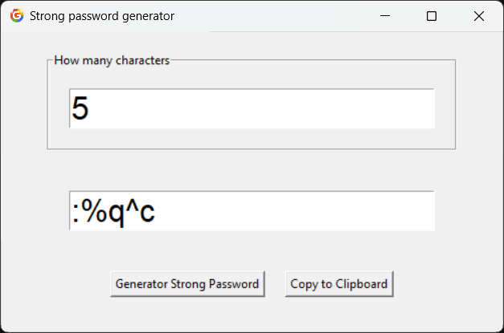

# 🔐 Strong Password Generator (Python + Tkinter)

A simple and powerful **GUI-based Password Generator** built using Python and Tkinter.
This app allows users to generate strong random passwords and copy them instantly.

---

## 🚀 Features

* Generate secure random passwords
* Choose password length
* One-click copy to clipboard
* Simple and clean GUI
* Lightweight and fast

---

## 🖼️ Preview



> 📌 Make sure to add your screenshot image in the project folder and name it `screenshot.png`

---

## 🛠️ Technologies Used

* Python 🐍
* Tkinter (GUI)
* Pillow (for icon support)

---

## 📂 Project Structure

```
Password Generator/
│
├── main.py
├── icon.png
├── screenshot.png
└── README.md
```

---

## ⚙️ Installation

1. Clone the repository:

```
git clone https://github.com/your-username/password-generator.git
```

2. Navigate to the project folder:

```
cd password-generator
```

3. Install required modules:

```
pip install pillow
```

4. Run the program:

```
python main.py
```

---

## 🎮 How to Use

1. Enter the number of characters
2. Click **"Generate Strong Password"**
3. Copy the password using **"Copy to Clipboard"**

---

## 💡 Future Improvements

* Add password strength indicator
* Add options (letters, numbers, symbols)
* Save generated passwords
* Dark mode UI

---

## 🤝 Contributing

Feel free to fork this project and improve it!

---

## 📜 License

This project is open-source and free to use.

---

## 👨‍💻 Author

Made by **Sayan Oraon**
